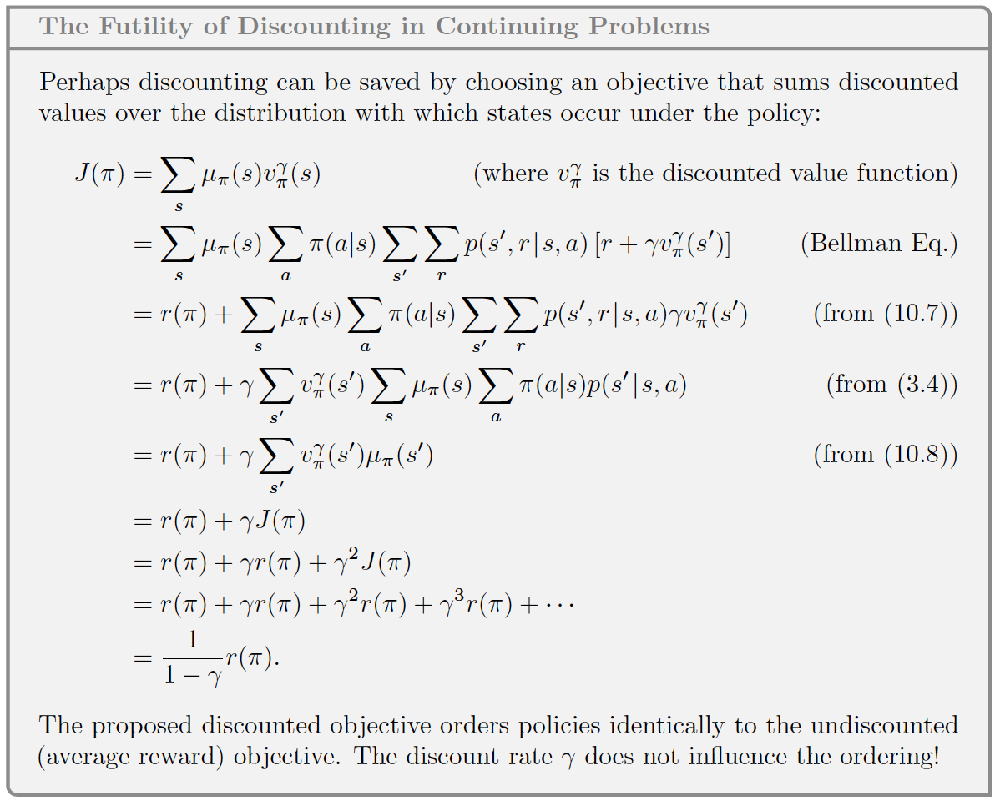
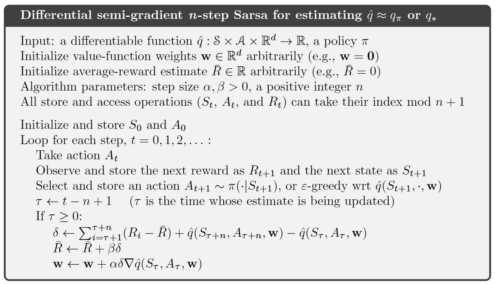
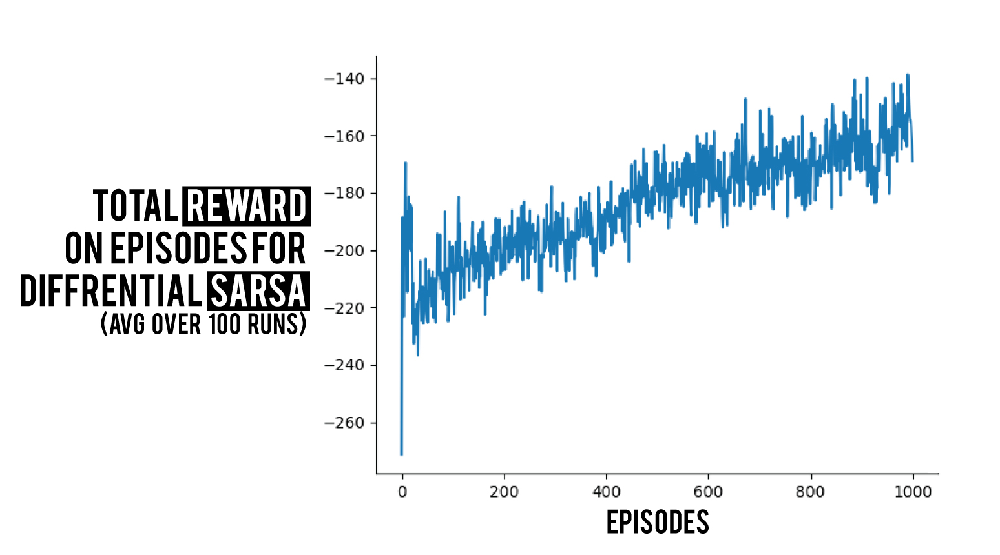

### Prerequisites 

- Intro to Linear Methods
- Semi-Gradient Prediction
- [Semi-Gradient SARSA](https://bedirt.github.io/reinforcement%20learning/control%20methods/2020/03/10/Semi-Gradient-Control.html) 

## What is continuous?

Let's first describe the main task we will be handling; continuity. Continuous problems are tasks that has no specific terminal state, therefor will go on forever. As simple as it sounds, it is not a piece of cake to tackle the issues it brings with itself. Some examples could be the stock-market, where there is no end and you keep getting data. Or as book suggests access-control queuing task (Example 10.2).

I will follow a simple format so that we all can stay on the same page and everything is clear cut:

- Why is discounting not applicable for continuing tasks?
- The Remedy: Average Reward
  - Logic behind it
  - Why is it true: Math
- Differential Semi-Gradient SARSA

So let's start.

## Why is discounting not applicable for continuing tasks?

First of all, we should know that discounting works well for tabular cases. The issue we will be talking about rises when we start to use approximations. 

We have a sequence of episodes that has no beginning or end, and no way to clearly distinguish them. As the book suggests, we have the feature vectors to maybe have a use of, but then the issue of **clearly seperable** arises. We might have two feature vectors that has no to little difference between them, which won't be possible to be able to distinguish.

Since we have no start point or end point, and since there is no clear line in between episodes, using discounting is not possible. Well it actually is possible. But it is not needed. Actually using $\gamma = 0$ will give the same results as any other one. That's because the discounted rewards are proportional to average reward. That's why instead we will only use average reward. Here I will put the proof that both will results in the same order (discounted and without discounting):



The main issue with discounting in the approximation cases is that, since we have states depending on the same features, we do not have the **policy improvement theorem** anymore. Which was stating that we can get the optimal policy, just by changing all the action selections to the optimal ones for each state. Since we could choose the probabilities for one state without effecting the others it was pretty easy to handle. Now that we lost that property there is no guaranteed improvement over policy. 

As Rich puts it *"This is an area with multiple open theoretical questions"*. If you are interested.

## The Remedy: Average Reward

Average reward is a pretty popular technique used in dynamic programming. Later on included into the Reinforcement Learning setting. We use average reward for approximated continual setting as we discussed above. Without discounting means that we care about each reward equally without thinking of if it occurs in far future etc.

We denote it as $r(\pi)$. Not much detail but for the intuition part I will give the main definition for it:
$$
r(\pi) \doteq \sum_{s}\mu_\pi\sum_{a}\pi(a|s)\sum_{r, s'}p(r, s'|s, a) r
$$
Basically we consider the best policy as the policy which has the most $r(\pi)$. For average reward we define returns as the difference between the $r(\pi)$ and the reward received at that point, this is called the differential return:
$$
G_t = R_{t+1} - r(\pi) + R_{t+2} - r(\pi) + \ldots
$$
I believe differential return holds almost all the properties normal returns had. Only change we will do is to replace the reward with the difference i.e. $R_{t+1} - r(\pi)$. This goes for TD errors, bellman equations etc. 

### Quick Math

So we already saw the formula for $r(\pi)$ but we didn't actually see how it came to existence or what all those things mean.
$$
r(\pi) \doteq \lim_{h\rightarrow\infty} \frac{1}{h} \sum_{t=1}^{h}\mathbb{E}[R_t|S_0, A_{0:t-1} \sim \pi]
$$
Let's explain what's happening here. We are assuming we have $h$ number of rewards, we are summing expected value of all the rewards given the first state and the action trajectory following the policy $\pi$, and we are dividing it to $h$ to get to the average of these rewards. So we simply had $h$ many rewards and we got the average. Then;
$$
= \lim_{t\rightarrow\infty} \mathbb{E}[R_t|S_0, A_{0:t-1} \sim \pi]
$$
Since I have the expectation inside the summation, we can actually simplify the summation with the division. We do have to put $t\rightarrow\infty$ to ccorrect the formula, as we will have number of samples approaching infinity. Next jump on the book seems fuzzy, but when you open it up it is extremely easy to see how it happens.

So if we have a randomness over something, what we want to do is to get the expectation of it. If we get the expectation that means we can formulate it, therefor no more randomness. In an MDP we have three kind of randomness possibly can happen.

- States are random
- Actions are random
- Dynamics are random

What does this mean? It means we can be in a state, and we don't know what state that might be, and from there we will take an action, but we don't know for sure which action will that be. And the last one is that we take that action but since we don't know the dynamics of the environment (if stochastic even if we do know) we don't know which state we will end up in. So actually this formula goes like;
$$
\mathbb{E}[\mathbb{E} [ \mathbb{E}[R_t|S_t, A_t]]]
$$
Where the inner most is for the states and in the middle its the actions, the last one is the dynamics. So we know from bellman equations how to write this down;
$$
\mathbb{E}[R_t] = \sum_{s',r}p(s',r|s, a) r
$$
This is the expected reward is it not ? Now lets add the action selection on top:
$$
\mathbb{E}[R_t|A_t] = \sum_{a}\pi(a|s)\sum_{s',r}p(s',r|s, a) r
$$
One last thing left is the state selection. We are using $\mu_\pi(s)$ to specify state distribution given the state (which the book covered earlier - Chapter 9). So the last piece of the puzzle;
$$
\mathbb{E}[R_t|A_t, S_t] = \sum_{s}\mu_\pi(s)\sum_{a}\pi(a|s)\sum_{s',r}p(s',r|s, a) r
$$
That's all, we therefor have the average reward formula covered.

In practice we will be using moving mean to calculate average reward.

## Differential Semi-Gradient SARSA

Well, I don't really have much to add. If you read the [Semi-Gradient SARSA](https://bedirt.github.io/reinforcement%20learning/control%20methods/2020/03/10/Semi-Gradient-Control.html) post, this is mostly just changing the update rule for the continuous setting. That will be the change for $G_{t:t+n}$.

$$G_{t:t+n}=R_{t+1}-\bar{R}_{t+1}$$

$$+R_{t+2}-\bar{R}_{t+2}$$

$$+\ldots+ R_{t+n}-\bar{R}_{t+n}$$

$$+\hat{q}(S_{t+n},A_{t+n},w_{t+n-1})$$


The TD error then will be like:

$$
\delta_t = G_{t:t+n} - \hat{q}(S_t, A_t, w)
$$

and we will use another step size parameter $\beta$ to update the average reward value. Here is the pseudocode:



And here is my implementation of it, which does not require much explanation I assume:

```python
def update(self, observations, actions, rewards):
  	if len(observations) > self.n:
        observations.pop(0)
        rewards.pop(0)
        actions.pop(0)

    if len(rewards) == self.n:
        G = sum([(r - self.avg_rew) for r in rewards[:-1]])
        G += self._q_hat(observations[-1], actions[-1])
        delta = G - self._q_hat(observations[0], actions[0])
        self.avg_rew += self.beta * delta
        self.w += self.alpha * delta * 
          self._grad_q_hat(observations[0], actions[0])
```

It is basically almost the same with the previous version. We are first checking if we have more elements than $n$ which means we need to remove the first elements from the storage. Then we have a check which sees if we have enough elements, because we won't be making any updates if there is not at least $n$ elements in the trajectory. The rest is the same update as in the pseudocode.

Again we run an experiment using the same settings as before which results in a high varience learning, thought it does learn which is the point here right now 😄.



I have a blog series on RL algorithms that you can [check out](https://bedirt.github.io/tags/#betterrl-series). Also you can check [BetterRL](https://github.com/BedirT/BetterRL) where I share raw python RL code for both environments and algorithms. Any comments are appreciated!

[For full code](https://github.com/BedirT/BetterRL/blob/master/value_based/Semi_Gradient_differential_SARSA.py)