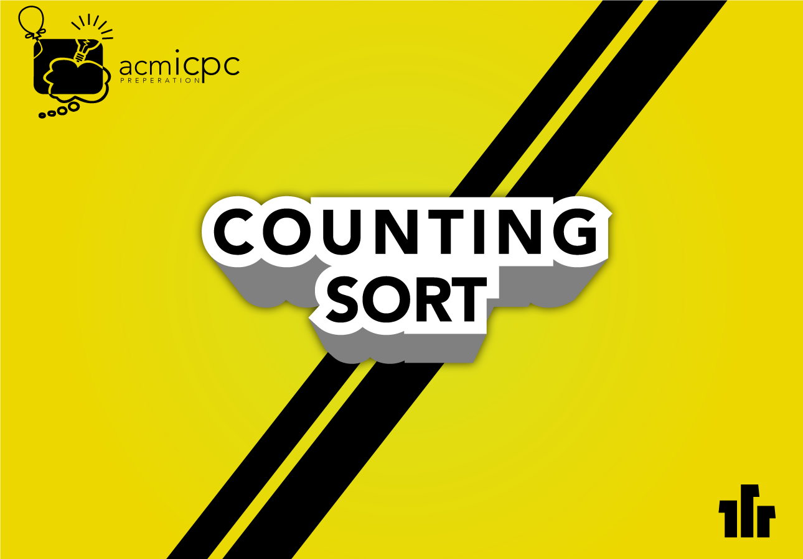

Counting sort is a nice in-place sorting algorithm that we can use for sorting instantly. (This is mostly used for competitive programming.) What I meant by this is, we can use counting sort when we are getting the input. This will not get any additional cost for us, and really good technique for using in-place sorting. I'll get there after explaining the algorithm.

<!--more-->

<!--  -->

### Complexity ?
---

Let me tell you the complexity if you are wondering, but I will explain "why" after the algorithm itself. **O(n+k)** : n , is size of the array that we will sort and k is the maximum element we have.

### Algorithm
---

OK. Let's think of an array. For the sake of simplicity, let's make it short...

          myArray = [2, 3, 7, 4, 3, 9]

We have an array -unsorted- , minimum number is **2**, maximum is **9** and we have **6** elements in the array. Alright so let's think of one more array. Which is from 0 (array starting point) to our maximum number (9) and all the values are initially **0**.

          INDEXES    0  1  2  3  4  5  6  7  8  9
    weAreCounting = [0, 0, 0, 0, 0, 0, 0, 0, 0, 0]

**ATTENTION!** We are going to iterate over first array one by one, and we will increment the values that we have (i.e. for first step it is myArray[0] which is 2 so go to weAreCounting array and increment [2] by 1):

    for i in myArray:
        weAreCounting[i] += 1

NOW WHAT WE HAVE AT THE END OF THIS LOOP? 

          INDEXES    0  1  2  3  4  5  6  7  8  9
    weAreCounting = [0, 0, 1, 2, 1, 0, 0, 1, 0, 1]

So weAreCounting array basically shows us how many of these numbers we do have (i.e. we have 2 threes so weAreCounting[3] = 2).

This part is how you have all the items counted. Now we can use this as sorted array (with iterating over it) or we can have our new array that will have the sorted array directly. For the second version:

My logic will be to use same array before (myArray) so that it will be more efficient (space-wise).

So I iterate thorough weAreCounting and if the number is bigger than 0 I will add it into myArray. That is all of the logic. 

### Code
---

Here is the c++ code, as simplified as possible. ENJOY!

```cpp
void countingSort (int * arr) {
    
    int countingArray[MAX_NUM] = {0};
    
    for (i = 0 ; i < ARRAY_SIZE ; i++)
        countingArray[arr[i]]++;
    
    int output_Index = 0;
    
    for (i = 0 ; i < MAX_NUM ; i++)
        while ( countingArray[i]-- ) // Process will continue until the elements reach to 0
            arr[output_Index++] = i; // PS: Incrementing will be after the line_process
        // Instead of these two lines we could use memset function too...
    
}
```

And here is python3.

```python
def countingSort(arr):
    k = max(arr)
    countingArray = [0] * (k + 1)
    for i in arr:
        countingArray[i] += 1
    
    j = 0
    for i in range(k+1):
        while(countingArray[i] > 0):
            arr[j] = i
            countingArray[i] -= 1
            j += 1
    
    return arr

a = countingSort([3, 4 ,5 ,1, 10, 3, 2])
```

If you check the complexity in the code, you will see that we have two loops, one is doing n operation (going through the array that we will sort). Second loop is doing k operation (which is the maximum number that we have in the array that we will sort). So time complexity will be O(n+k). 

The space complexity: we have two arrays (we could have 3 but we decrease it to 3 because we used the one at the beginig two times. Since at the end we will not going to need that one.) one is size of n and one is size of k so our complexity will be O(n+k).

Now I suggest you to go to the link below, and try to solve the questions in Week 3/ Counting Sort section. So that you will have full understanding about this question. If you like the concept of it you can star or watch out repository as well. Have a great one!

[You can also find other algorithms explained and full code samples about this one here](https://github.com/NAU-ACM/ACM-ICPC-Preparation) (Check Week 3)