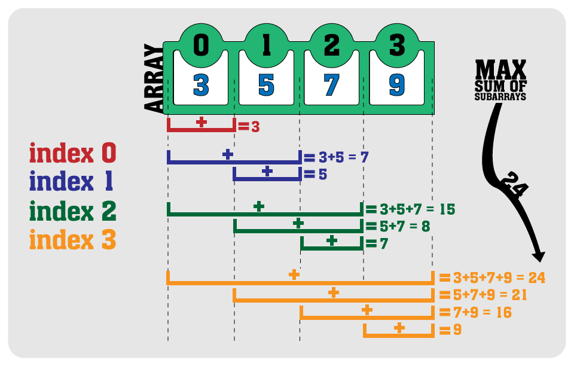
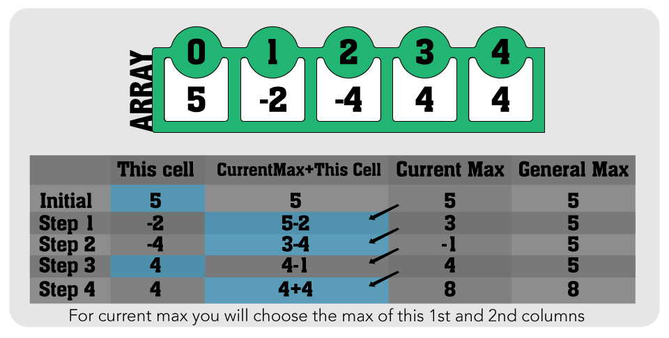

What we will learn today is, how to find the , in optimal solution. First, let's clarify the goal a bit.
<!--more-->

What is subarray? Subarray is an array that is included in the bigger array. So if we have an array that has 7 elements in it. What we have is elements that have indexes of: 0, 1, 2, 3, 4, 5, 6 . A subarray is smaller array inside of this big array. So for example 1, 2, 3  or 4, 5 are subarrays. But 1, 3 is not a subarray because the subarray should be contiguous. So our task is to find the largest contiguous array in our big array.

Since we clarify our objective let's look at the solutions we have. First let's see what will be the brute force solution since that will be the first one which comes to mind. What we would do is, we would start from 0 index and hold it, check every elements before that index and keep the largest one. So if we have [3, 5, 7, 9] in the array. We would first check the 3. We would see that it is the largest subarray since there is none other than that. And than we would check the index 1 -> 5, we have 5 and 5 + 3 = 8. The bigger one is 8 so we keep 8. Than we go for 2nd index -> 7. We have 7, 7+5, 7+5+3 so that biggest one will be 7+5+3 which is 15, we keep it. Then next one : index 3 -> 9. We have 9, 9+7, 9+7+5, 9+7+5+3. Largest one will be 9+7+5+3 = 24. So we compare the ones we found as sum of subarrays and the greatest one will be 24, the last one we checked, that's because we have no negative elements in the array. Anyways that would be the brute force solution and still a smart one. But the time complexity would be O(n^2). Since we take the index and check every others that we can combine with this index. Let me visualize this one:

OK, we got this part. So we got the question, now what is the optimal solution for this problem. What is this guy , [Kadane](https://en.wikipedia.org/wiki/Joseph_Born_Kadane) , found. Here is the algorithm then. This algorithm is dynamic, which means we will approach the result using the ones we find before. OK, this guy teaches us a way that has complexity O(n), linear time. 

Let's go with an example so it will be more clear. Our array is [5, -2, -4, 4, 4]. Kadane says that in each iteration we have only two options to get the max subarray:

1. It can be only itself
2. It can be itself combined with the maximum subarray that previous index has.

Man, this is a smart solution. OK, what he says is let's say we calculated the sum of maximum subarrays until index 1 which has value -2. For the sake of understanding let's calculate with brute force. We have -2 and -2+5. The greater one is -2+5 = 3. So let's proceed. This time let's use Kadane's Algorithm for calculating the 3rd step. What are the options:

1. It can be only itself (We have -4 as the 2nd indexed value so = **-4**)
2. It can be itself combined with the maximum subarray that previous index has. (We have 3 as 1st index's max Subarray sum, so = **3-4** = **-1**)

So we have a -1 and -4 ... -1 indeed. But is it always the second option then? Let's see with another part of our array. Let's proceed one more step. Don't forget that we have -1 as our current max. 3rd index ->

1. It can be only itself (We have 4 as the value = **4**)
2. It can be itself combined with the maximum subarray that previous index has. (We have -1 as the previous index's maximum -> **-1+4=3**)

Now we approached the first option, 4 > 3 so we will keep 4 instead of 3. And repeat this until the end ... Really that's all.

Now that we understand the logic. Let's proceed to the code. I will give pseudocode here.

    kadane(Array){
    
        generalMaximum = currentMaximum = Array[0]
    
        for (i = 1 until n) {
            currentMaximum = maximum of(Array[i], currentMaximum + Array[i]);
            if(currentMaximum >= generalMaximum) generalMaximum = currentMaximum;
        }
    
        return generalMaximum;
    
    }

If you are interested on learning or practicing more algorithms, you can visit our curriculum from github [ACM-ICPC Preparation](https://github.com/NAU-ACM/ACM-ICPC-Preparation). There are also questions and source code's about this topic. ENJOY!