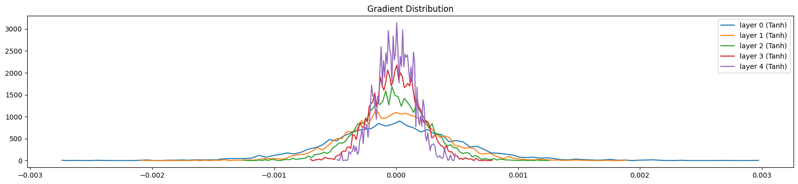

This post includes my notes from the lecture “Makemore Part 3:  Activations & Gradients, BatchNorm” by Andrej Karpathy.

Link of the video: [https://www.youtube.com/watch?v=P6sfmUTpUmc](https://www.youtube.com/watch?v=P6sfmUTpUmc)

## Initialization

Fixing the initial Loss:

- Initial loss must be arranged (the value depends on the question), in our case its a uniform probability.
- When initializing make sure the numbers do not take extreme values (`* .01`)
- Do not initialize to 0
- Having `0` and `1` in softmax (a lot of them) is really bad, since the gradient will be 0 (vanishing gradient). This is called **saturated tanh**.
- **So in summary:** What we did is basically just making sure initially we give the network random values such that it is varied, and not making gradients 0 (no dead neurons). In the case of tanh, when we use softmax to squash the values, if the initial values were too broad, we will get a lot of vanishing gradients due to values ending up above `1` or below `-1`. So we first reduce the initial values and then use softmax on them (and continue training process).

## Kaiming Init

Okay we know how to fix initialization now, but how much should we reduce these numbers? Meaning what is the value we should scale the layers with. Here comes **Kaiming init**.

- Here are two plots, left is for `x` and right is for `y` (pre activation, `x @ w`) layer values. We see that even though `x` and `w` are uniform gaussian with unit mean and standard deviation, the result of their dot product, y, has a non-unit standard deviation (still gaussian).

    

- We don’t want this in a neural network, we want the nn to have relatively simple activations, so we want unit gaussian throughout the network.
- To keep std of `y` unit, we need to scale `w` down, as shown in the figure below (`w` scaled by `0.2`), but with what exactly?

    

- Mathematically this scale is equal to the square root of fan-in (number of input dimensions, e.g `10` for a tensor of `(10, 1000)`).
- Depending on the activation function used, this value needs to be scaled by a **gain**. This gain is $\frac{5}{3}$ for tanh and 1 for linear, and $\sqrt{2}$ for relu. These values are due to shrinking and clamping the values (on relu and tanh).
- Kaiming init is implemented in pytorch as `torch.nn.init.kaiming_normal_`.
- Since the development of more sophisticated techniques in neural networks the importance of accurately initializing weights became unnecessary. To name some; residual connections, some normalizations (batch normalization etc.), optimizers (adam, rmsprop).
- In practice, just normalizing by square root of fan-in is enough.

Now that we see how to initialize the network, and mentioned some methods that makes this process more relaxed, let’s talk about one of these innovations; **batch normalization**

## Batch Normalization

- We mentioned while training the network that we want balance in the pre-activation values, we don’t want them to be zero, or too small so that tanh actually does something, and we don’t want them to be too large because then tanh is saturated.
- So we want roughly a uniform gaussian at initialization.
- Batch Normalization basically says, *why don’t we just take the hidden states and normalize them to be gaussian.*
- Right before the activation, we standardize the weights to be unit gaussian. We will do this by getting the mean and std of the batch, and scaling the values. Since all these operations are easily differentiable there will be no issues during the backprop phase.
- For our example;

    ```python
    # Forward pass
    emb = C[x_train[idx]]
    embcat = emb.view(-1, emb.shape[1] * emb.shape[2])
    hpreact = embcat @ W1 + b1
    ```

    Will have the batch norm before the activation is introduced. For this we need to calculate the mean and standard deviation of the batch;

    ```python
    hmean = hpreact.mean(0, keepdim=True)
    hstd = hpreact.std(0, keepdim=True)
    ```

    Here we use `0` for the dimension since the shape of `preact` is `[num_samples, num_hidden_layers]` and we want the mean and std for all the samples for the weight connecting to one hidden layer. So the dimensions of `hmean` and `hstd` will be `[1, num_hidden_layers]`. So in the end we update our hpreact to;

    ```python
    hpreact_bn = (hpreact - hmean) / hstd
    ```

- If we leave it at that, we now have the weights forced to be unit gaussian at every step of the training. We want this to be the case only at the initialization. In general case we want the neural network to be able to move the distribution and scale it. So we introduce one more component called **scale and shift**.
- These will be two new parameter set we add on our list that we start the scale with `1` and shift with `0`. We then backpropagate through these values and give the network the freedom to shift and scale the distribution;

    ```python
    bnorm_scale = torch.ones((1, num_hidden_neurons))
    bnorm_bias = torch.zeros((1, num_hidden_neurons))
    ```

    We then update our `hpreact_bn` :

    ```python
    hpreact_bn = ((hpreact - hmean) / hstd) * bnorm_scale + bnorm_bias
    ```

    We also add the new parameters in our parameters, to update while optimize the network:

    ```python
    parameters = [C, W1, b1, W2, b2, bnorm_scale, bnorm_bias]
    ```

- It’s common to use batch norm throughout the neural network to be able to have a more relaxed initializations.
- When introduced batch norm, we make the results of the forward and backward pass of any one input dependent on the batches. Meaning the result of a single sample is now not just dependent on itself but the batch it came with as well. Surprisingly, this is unexpectedly proven to be a good thing, acting as a regularizer.
- This coupling effect is not always desired, which is why some scholars looked into other non-coupling regularizers such as Linear normalization.
- One thing that still needs adjustment is how to use batch norm in testing phase. We trained the network on batches using batch mean and std but when the model is deployed, we want to use a single sample and get the result based on that. First method for accomplishing this is to calculate the exact mean and std on the complete dataset after training, like:

    ```python
    with torch.no_grad():
        emb = C[x_train]
        embcat = emb.view(-1, emb.shape[1] * emb.shape[2])
        hpreact = embcat @ W1 + b1
        bn_mean = hpreact.mean(0, keepdim=True)
        bn_std = hpreact.std(0, keepdim=True)
    ```

    And using `bn_mean` and `bn_std` instead of `hmean` and `hstd` from the training loop.

    We can further eliminate this step using a running mean and std. For this purpose we introduce two new parameters:

    ```python
    running_mean = torch.zeros((1, num_hidden_neurons))
    running_std = torch.ones((1, num_hidden_neurons))
    ```

    Then in the main training loop we update these values slowly. This will give us a close estimate.

    ```python
    # Updating running mean and std
    with torch.no_grad():
        running_mean = 0.999 * running_mean + 0.001 * hmean
        running_std = 0.999 * running_std + 0.001 * hstd
    ```

- There is a minor addition of $\epsilon$ on the paper to the denominator of the batch normalization. The reason is to avoid division by zero. We did not make use of this epsilon since it is highly unlikely that we get a zero std in our question.
- Last fix we need to do is on bias. When we introduced the batch norm we made the bias `b1` useless. This is due to the subtracting the mean after applying the bias. Since the mean includes bias in it, we are practically adding and removing the same value, hence doing an unnecessary operation. In the case of batch norm, we do not need to use explicit bias for that layer, instead the batch norm bias, or `bnorm_bias` will handle the shifting of the values.
- Use batchnorm carefully. It is really easy to make mistakes, mainly due to coupling. More recent networks usually prefer using layer normalization or group normalization. Batchnorm was very influential around 2015, since it introduced a reliable training for deeper networks because batchnorm was effective on controlling the statistics of the activations.

## Diagnostic Tools

Training neural networks without the use of tools that makes initialization more relaxed, such as adam or batch normalization, is excruciating. Here we introduce multitudes of techniques to evaluate the correctness of the neural network.

### Activation Distribution

- First of, activation distribution throughout the layers. We are using a somehow deep network to be able to see the effects, with 5 layers. Each linear layer is followed by a `tanh`. As we saw before, `tanh` kaiming scale is $\frac{5}{3}$. Here is how the activations look like when we have it right:

    

    We see that the layers have somehow similar activations throughout, saturation is around 5% which is what we wanted. If we change the scaling value to $1$ instead:

    

    We get an unbalanced activations with 0 saturation. To see even more clear, let’s set the value to $0.5$:

    


### Gradient Distribution

- The next test is on gradients. Same as before we want the gradients throughout the layers to be similar. Here is the gradient distribution when we actually use $5/3$ as our scaling value:

    

    As opposed to $$ $3$:

    

    We can see here that the gradients are shrinking.


### Weight-Gradient Distribution on Parameters

What are we checking:

- The std should be similar across layers
- The mean should be similar across layers
- The grad:data ratio should be similar across layers

Grad:data ratio gives us an intuition of what is the scale of the gradient compared to the actual values. This is important because we will be taking a step update of the form `w = w - lr * grad`. If the gradient is too large compared to the actual values, we will be overshooting the minimum. If the gradient is too small compared to the actual values, we will be taking too many steps to reach the minimum.

The std of the gradient is a measure of how much the gradient changes across the weights. If the std for a layer is too different from the std of the other layers, this will be an issue because this layer will be learning at a different rate than the other layers.

This is for initialization phase. If we let the network train for a while, it will fix this issue itself. Nevertheless, this is an issue especially if we are using a simple optimizer like SGD. If we are using an optimizer like Adam, this issue will be fixed automatically.

Here are examples;

```python
weights torch.Size([33, 10]) - mean +0.000207 - std 3.741454e-03 - grad:data ratio 3.559389e-03
weights torch.Size([50, 100]) - mean +0.000027 - std 2.011833e-03 - grad:data ratio 4.706446e-03
weights torch.Size([100, 100]) - mean -0.000008 - std 1.438244e-03 - grad:data ratio 4.848074e-03
weights torch.Size([100, 100]) - mean -0.000005 - std 9.275978e-04 - grad:data ratio 3.078747e-03
weights torch.Size([100, 100]) - mean -0.000007 - std 7.061330e-04 - grad:data ratio 2.373874e-03
weights torch.Size([100, 100]) - mean -0.000000 - std 5.087151e-04 - grad:data ratio 1.693161e-03
weights torch.Size([100, 33]) - mean +0.000000 - std 2.043289e-02 - grad:data ratio 2.027916e+00
```


We can see that the ratio of the last layer is way too large, as well as its standard deviation. Which is why the pink line on the graph is too wide.

### Update Ratio

We calculate the update std’s ratio with real value, and this gives us a measure for learning rate. Roughly the layers are all should be around `-3`


The formula is for each epoch: `[(lr * p.grad.std() / p.data.std()).log().item() for p in params]`.