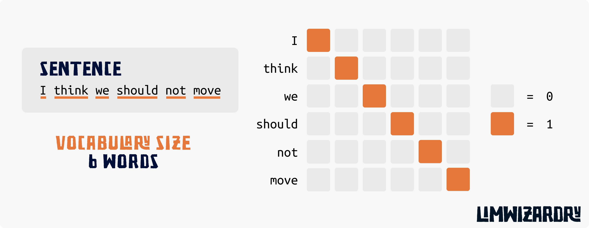

Welcome to the first post on LLMWizardry series! For more information about the series please check out the project [repository](https://github.com/BedirT/LLMWizardry).

In this post, we will be covering the basics of NLP to build a solid foundation for the LLMWizardry series, hence LLMs. Here are the topics we are handling in this post:

- Pytorch Fundamentals
- Tensors and tensor operations
- The Advantages of Embracing Tensors (Optional)
- Tokenizers
    - Byte-pair Encoding
    - Sentencepiece
- Vectorization
    - One-hot Encoders
    - TF-IDF
- Word Embeddings
    - Word2Vec
    - GloVe

Without further ado, let's get started!

# Fundamentals


Feel free to skip over the parts that you feel confident.


Here is a list of topics we will be covering in this section:

- [Very Basics of Pytorch](#very-basics-of-pytorch)
- [Tensors and tensor operations](#tensors-and-tensor-operations)
- [The Advantages of Embracing Tensors (Optional)](#the-advantages-of-embracing-tensors-optional)


If I missed any topic that is used in LLMWizardry series and not mentioned in pre-requisites, please submit [an issue](https://github.com/BedirT/LLMWizardry/issues) so that I can add a section for it.


## Very Basics of Pytorch

In this section we will be covering the very basics of PyTorch. I will mainly mention things that are going to be used in the continuation of the series, but since most of the details are about how the library is used around tensors, some things will just be shallowly mentioned or coded since we are explaining the tensors in the next section. No need to worry, we have the necessary codes all explained in the next section.

[PyTorch](https://pytorch.org/) is an open-source machine learning library developed by [Meta's Fundamental AI Research team (FAIR)](https://ai.meta.com/research/). It is one of the most popular Machine Learning library out there. Here, we will cover the very basics of PyTorch to be able to follow along with the rest of the series.

### Installation

You can install PyTorch using pip. The official website has a very good [installation guide](https://pytorch.org/get-started/locally/).

### Tensors

At the core of PyTorch are tensors, which we will cover in depth next section. Tensors in PyTorch are similar to NumPy arrays but with additional capabilities to utilize the power of GPUs for accelerated mathematical computations.

Let's see some basic operations in PyTorch, without going into the details of tensors.

```python
import torch

# creating a tensor
x = torch.tensor([1, 2, 3])
print(x)
```

#### Tensor Attributes

Tensors have a few important attributes that are commonly used in PyTorch:

- **dtype**: The data type of the tensor. It can be `torch.float32`, `torch.float64`, `torch.int32`, `torch.int64`, etc.
- **device**: The device where the tensor is stored. It can be `cpu` or `cuda` (for GPUs).
- **shape**: The dimensions of the tensor. It is a tuple of integers representing the size of the tensor along each dimension.

```python
import torch

# creating a tensor
x = torch.tensor([1, 2, 3])

print(x.dtype)
print(x.device)
print(x.shape)
```

#### Moving Tensors to GPU

PyTorch tensors can be moved to the GPU using the `to` method. This is one of the most important features of PyTorch, as it allows us to perform high-speed tensor operations on the GPU.

```python
import torch

x = torch.tensor([1, 2, 3])

if torch.cuda.is_available():  # checking if GPU is available
    x = x.to('cuda')
    print(x.device)
```

#### Autograd: Automatic Differentiation

PyTorch has a feature called `autograd`. It provides automatic differentiation for all operations on tensors. This is especially useful for neural network training, where backpropagation requires derivatives.

Note: If you are not familiar with the concept of gradients and automatic differentiation, please consider checking out the extra resources listed above before continuing with the post.

To use autograd, you need to set `requires_grad=True` for our tensors:

```python
import torch

x = torch.tensor([1., 2., 3.], requires_grad=True)

# perform some operations
y = x**2
z = y.sum()

# compute gradients
z.backward()

# print the gradients
print(x.grad)
```

## Tensors and tensor operations

More information: https://dmol.pub/math/tensors-and-shapes.html#:~:text=The%20components%20that%20make%20up,the%20dimension%20of%20each%20axis.

Tensors are one of the main components in almost every machine learning approach. To be able to grasp the upcoming posts on transformers we will need a solid understanding of what tensors are, how are they useful and how do we manipulate them.

If this post was not enough in explaining please consider checking out the extra resources listed above before continuing with the post.

### What is a Tensor?

In the context of Machine Learning, a tensor is an `n`-dimensional array where `n` could be any integer above 0. We can think of a tensor as a box that keeps its items in a specific structure. To visualize a bit more vividly:
- A **0-dimensional tensor** is a single number, or scalar (e.g., [7]).
- A **1-dimensional tensor** is an array of numbers, or vector (e.g., [1, 2, 3]).
- A **2-dimensional tensor** is an array of arrays, or a matrix (e.g., [[1, 2, 3], [4, 5, 6]]).
- A **3-dimensional and higher-dimensional tensors** can be thought of as arrays stacked on top of each other, forming a cube or a hypercube for even higher dimensions.



<video width="100%" height="auto" controls autoplay loop muted>
  <source src="images/tensor.mp4" type="video/mp4">
  Your browser does not support the video tag.
</video>



In the image above, we can see the relationship between different dimensional tensors. We think of the initial box as the scalar value, and it turns into a vector when we put multiple boxes next to each other. Then we stack these vectors on top of each other to form a matrix. We can then continue the same process and get infinite dimensional tensors.

Let's also look at some python code, that we probably used many times before, and actually are tensors.

```python
# a 0-dimensional tensor: a scalar
scalar_tensor = 34

# a 1-dimensional tensor: a vector -> a list
vector_tensor = [1, 4, 3]

# a 2D tensor: a matrix -> a one layer nested list
matrix_tensor = [[1, 3],[4, 6]]

# even more!
three_d_tensor = [[[1, 2],[3, 4]],[[5, 6],[7, 8]]]
```

Last thing I want to mention about tensors is their **shape**. Shape of a tensor is practically a series of numbers explaining the size of each of the demensions of the tensor. It's important to understand the shape concept well as many of the operations need compatible shapes.

Let's see it in action:
```python
# continuing from the above tensors
vector_tensor.shape
# (3,)

matrix_tensor.shape
# (2, 2)

three_d_tensor.shape
# (2, 2, 2)
```

So a shape of matrix in python would be: `(len(matrix), len(len(matrix[0])))`.

### Tensors in PyTorch

It's very easy to create tensors in pytorch. We also have some special functions that will make our lifes easier. Let's start with creating tensors.

We use `torch.tensor` to create tensors in pytorch.

```python
import torch

# we can create a tensor from a list
two_d_list = [[1, 3],[4, 6]]
print(torch.tensor(two_d_list))
```

We can also create tensors with zeros, ones, random numbers, and even with a specific range of numbers. We use a tuple to represent the shape of the tensor.

```python
import torch

# creating a tensor with zeros
torch_zeros = torch.zeros((2, 2))   # 2x2 matrix
print(torch_zeros)

# creating a tensor with ones
torch_ones = torch.ones((2, 2))     # 2x2 matrix
print(torch_ones)

# creating a tensor with random numbers
torch_random = torch.rand(2, 2)     # 2x2 matrix
print(torch_random)

# creating a tensor with a specific range of numbers
torch_arange = torch.arange(0, 10, 2)   # 1x5 vector
print(torch_arange)
```

### Tensor Operations

There are some mathematical manipulations that are performed on tensors. These are ranging from simple math operations like addition, to some more complex linear algebra transformations that are pretty useful when using tensors. Here we will see some of the operations that are going to be useful for Machine Learning.

#### Addition and Subtraction

This is no different than a simple addition or subtraction we do on scalar values. e.g. $3 + 5 = 8$. Tensors can also be added or subtracted **if they have the same shape**. Look at the representation i made below; if we imagine a matrix as a sheet of paper, where each cell is a number, addition is just to put the numbers in corresponding cells on top of each other (or vice versa, subtract if we are doing subtraction).



<video width="100%" height="auto" controls autoplay loop muted>
  <source src="images/tensor_addition.mp4" type="video/mp4">
  Your browser does not support the video tag.
</video>




In the animation above, we have two $3 \times 3$ tensors. We will imagine the matrices in 3 dimension where 3rd dimension (size of the columns) represent the value in that cell. Addition in this case is to stack corresponding columns together. And the resulting column is the summation.

Let's see what would matrix addition in pure python:

```python
matrix_a = [[1, 2], [3, 4]]
matrix_b = [[5, 6], [7, 8]]

matrix_addition = [[0, 0], [0, 0]]
for r in range(2):
    for c in range(2):
        matrix_addition[r][c] = matrix_a[r][c] + matrix_b[r][c]
```

Let's see how we can do this in pytorch:

```python
import torch

matrix_a = torch.tensor([[1, 2], [3, 4]])
matrix_b = torch.tensor([[5, 6], [7, 8]])

matrix_addition = matrix_a + matrix_b
print(matrix_addition)

# or we can use the add function
matrix_addition = torch.add(matrix_a, matrix_b)

matrix_subtraction = matrix_a - matrix_b
print(matrix_subtraction)

# same with the subtraction
matrix_subtraction = torch.sub(matrix_a, matrix_b)
```

#### Multiplication

There are different ways of multiplication in tensors. We will see the most commonly used ones, that we are actually interested in. These are **element-wise multiplication** and **matrix multiplication/dot product**.

##### Element-wise Multiplication

Element-wise multiplication, also known as the Hadamard product (apprently - never heard of this until i was doing research for this post...), involves multiplying elements in two tensors of the same shape just like we did in addition. Think of the sheet of paper example I mentioned.

Let's again see it in action in pure python:

```python
# Element-wise multiplication of two 2x2 matrices
matrix_a = [[1, 2], [3, 4]]
matrix_b = [[5, 6], [7, 8]]

elementwise_multiplication = [[0, 0], [0, 0]]
for r in range(2):
    for c in range(2):
        elementwise_multiplication[r][c] = matrix_a[r][c] * matrix_b[r][c]
```

And in pytorch:

```python
import torch

matrix_a = torch.tensor([[1, 2], [3, 4]])
matrix_b = torch.tensor([[5, 6], [7, 8]])

elementwise_multiplication = matrix_a * matrix_b
print(elementwise_multiplication)
```

##### Matrix Multiplication / Dot Product

This is the only complicated operation in the list that we cover (in my opinion..). In this method, you multiply the rows of the first matrix by the columns of the second matrix and sum up the results to produce a new one.

Again we are doing element wise multiplication but only for the matching row and columns. We then sum these products to get a single number to place in the resulting matrix.


###### Why dot product?

The dot product reflects a form of "interaction" between elements of the original matrices. It's not simply a mathematical operation but a very important tool in handling the relationships and transformations in data.

Let's imagine we have a group of people and a set of skills, and we want to calculate the total skill level of the group in different tasks. Each person has a certain level of proficiency in each skill, and each task requires a certain combination of these skills.

- **Matrix A** represents people and their skill levels in different areas (rows for people, columns for skills).
- **Matrix B** represents how important each skill is for different tasks (rows for skills, columns for tasks).

The dot product of these matrices gives us a new matrix where each element represents the total proficiency of a person for a specific task, taking into account the importance of each skill for that task.

The dot product makes sense because it aggregates the contributions of different elements (e.g., skills) towards an outcome (e.g., tasks) by multiplying them and summing them up. This way we can transition from individual components to an integrated outcome, capturing the essence of relationships and transformations in data.

###### Understanding Matrix Dimensions in Dot Product

Let's take an example to clarify how the dimensions work in dot product operations:

- **Matrix A** is a $2 \times 3$ matrix (2 rows, 3 columns): It could represent 2 people with their levels in 3 different skills.
- **Matrix B** is a $3 \times 2$ matrix (3 rows, 2 columns): It represents how these 3 skills contribute to 2 different tasks.

When we multiply these matrices, the inner dimensions ($3$ in both cases, representing the skills) must match, and the result is a matrix with the outer dimensions, which in this case is a $2 \times 2$ matrix. This result matrix shows how each person is proficient in each of the 2 tasks, considering all their skills.

This operation is crucial in data science and machine learning, since understanding the interaction between data directly influences outcomes.

We could do all of this in a sequential and simple way like the code below. The reason we are actually performing dot product using matrices is all about performance and the beauty of parellelization using modern hardwares. More on this in the section on .

##### Code Examples

Let's write this in simple python.

```python
matrix_a = [[1, 2, 3], [4, 5, 6]]   # the shape is 2 x 3
matrix_b = [[3, 6], [2, 1]]         # and this one is 3 x 2

# The resulting matrix will be 2 x 2
elementwise_multiplication = [[0, 0], [0, 0]]

for r in range(2):
    for c in range(2):
        row = matrix_a[r]
        col = [matrix_b[0][c], matrix_b[1][c]]
        elementwise_multiplication[r][c] = sum([row[i] * col[i] for i in range(3)])
```

And let's see in a more efficient way in pytorch:

```python
import torch

matrix_a = torch.rand(2, 3)
matrix_b = torch.rand(3, 2)

dot_product = torch.mm(matrix_a, matrix_b)
print(dot_product)

# or we can use the matmul function
dot_product = torch.matmul(matrix_a, matrix_b)
print(dot_product)

# or we can use the @ operator
dot_product = matrix_a @ matrix_b
print(dot_product)
```

#### Reshaping

This is a critical operation in machine learning. Reshaping is basically converting a tensor into a different shape without changing the data.

We can think of reshaping as a way of reorganizing the boxes in the tensor. We can change the number of dimensions, the size of each dimension, or both.

Let's see the idea in action in pure python, I know this will look a bit silly, but I think it's nice to see the idea in a simple way.

```python
# reshaping a 2x2 matrix into a 4x1 vector
matrix = [[1, 2], [3, 4], [5, 6], [7, 8]]
reshaped_matrix = [1, 2, 3, 4, 5, 6, 7, 8]
```

And in pytorch:

```python
import torch

matrix = torch.tensor([[1, 2], [3, 4], [5, 6], [7, 8])
reshaped_matrix = matrix.view(8)
print(reshaped_matrix)

# or we can use the reshape function
reshaped_matrix = matrix.reshape(8)
```

#### Transpose

The transpose of a matrix is a new matrix whose rows are the columns of the original. It's like flipping the matrix. If the original matrix is $m \times n$, the transposed matrix will be $n \times m$.

In pure python:

```python
matrix = [[1, 2],
          [3, 4],
          [5, 6]]

num_rows, num_cols = len(matrix), len(matrix[0])
transposed_matrix = [[0] * num_rows for _ in range(num_cols)]

for r in range(num_rows):
    for c in range(num_cols):
        transposed_matrix[c][r] = matrix[r][c]
```

And in pytorch:

```python
import torch

matrix = torch.tensor([[1, 2], [3, 4], [5, 6])
transposed_matrix = matrix.t()

# or we can use the transpose function
transposed_matrix = matrix.transpose(0, 1) # 0 and 1 are the dimensions to swap

# if we have a 3D tensor we can also use the transpose function to swap the dimensions
matrix = torch.rand(2, 3, 4)
transposed_matrix = matrix.transpose(1, 2) # this will swap the 2nd and 3rd dimensions
print(transposed_matrix.shape)

# or we can use the permute function - this is more flexible and can be used to swap more than 2 dimensions. Let's say we want to swap the 1st and
# 3rd dimensions of a 3D tensor, we can do it like this:
transposed_matrix = matrix.permute(
    0, 2, 1
) # 0, 2, 1 are the new order of the dimensions
```

#### Broadcasting

Broadcasting is a powerful and sometimes confusing operation that allows PyTorch to work with tensors of different shapes when performing arithmetic operations. When operating on two tensors, PyTorch automatically expands one tensor to match the shape of the other without making actual copies of the data.

Imagine we have a $3 \times 3$ matrix and we want to add a $1 \times 3$ vector to each row of the matrix. Broadcasting allows us to do this without actually creating multiple copies of the vector.

In pure python:

```python
matrix = [[1, 2, 3],
          [4, 5, 6],
          [7, 8, 9]]

vector = [1, 2, 3]

num_rows, num_cols = len(matrix), len(matrix[0])
result = [[0] * num_cols for _ in range(num_rows)]

for r in range(num_rows):
    for c in range(num_cols):
        result[r][c] = matrix[r][c] + vector[c]
```

And in pytorch:

```python
import torch

matrix = torch.tensor([[1, 2, 3], [4, 5, 6], [7, 8, 9])
vector = torch.tensor([1, 2, 3])

result = matrix + vector
print(result, result.shape)
```

Important thing is that the shapes of the tensors should be compatible for broadcasting. The dimensions of the tensors are compared starting from the last dimension, and the dimensions are compatible when:

- They are equal, or
- One of them is 1, in which case the tensor with size 1 is expanded to match the size of the other.

So for example; a matrix with shape `(3, 4, 2)` can be broadcasted with a tensor of shape `(4, 2)` but not with a tensor of shape `(4, 3)`. Pytorch automatically expands the second tensor to `(1, 4, 2)` and then broadcasts it with the first tensor.

#### Slicing and Indexing

Slicing and indexing are used to access specific elements of a tensor. There is nothing special about this, it's just like slicing and indexing in python lists. Only difference is that we can do this in multiple dimensions.

In pure python:

```python
matrix = [[1, 2, 3],
          [4, 5, 6],
          [7, 8, 9]]

# get the first row
first_row = matrix[0]

# get the first column
first_col = [matrix[i][0] for i in range(3)]

# get the first two rows and the last two columns
submatrix = [[matrix[i][j] for j in range(1, 3)] for i in range(2)]
```

And in pytorch:

```python
import torch

matrix = torch.tensor([[1, 2, 3], [4, 5, 6], [7, 8, 9]])

# get the first row
first_row = matrix[0]

# get the first column
first_col = matrix[:, 0]

# get the first two rows and the last two columns
submatrix = matrix[:2, 1:]
```

## The Advantages of Embracing Tensors (Optional)

Tensors are at the core of modern machine learning, acting much like the Swiss Army knife for data scientists and AI researchers. Their power and efficiency in handling numerical computations unlock the potential for tackling complex problems, such as training the vast networks necessary for understanding images or processing natural language.

### Parallel Processing: The Speed Boost

Consider the difference between tackling a task alone versus in a group where the workload is shared. GPUs, with their capability for parallel processing, treat tensors not as singular entities to be dealt with one at a time but as collections to be processed simultaneously. This approach is akin to a well-coordinated team effort, significantly accelerating the training phases of sophisticated models like Transformers.

### Efficiency: Optimizing Data Flow

Tensors are designed for optimal data storage and access, ensuring that when computations are performed, especially on GPUs, they proceed without unnecessary delays. This efficiency is similar to having all the tools and materials for a project organized and within reach, minimizing the time spent searching and maximizing the time spent doing.

### High-Level Abstractions: Simplifying Complexity

By offering a high-level abstraction, tensors allow developers to concentrate on the broader strokes of their algorithms and model designs rather than the minutiae of data handling. This shift in focus is comparable to working with a blueprint for building a house, where the emphasis is on the architecture and design, not on manufacturing the bricks.

### Specialized Libraries: Tailored for Performance

With libraries like PyTorch and TensorFlow, the ecosystem around tensors is rich with optimized functions for a wide array of mathematical operations. These libraries harness the architecture of GPUs to enhance performance, making the computation not just faster but also more robust. It's akin to having access to a set of professional-grade tools specifically designed for your project's needs, ensuring both quality and efficiency.

### Scalability: Growing with Grace

As the complexity of machine learning models and the volume of data expand, tensors provide a scalable way to manage this growth. Their compatibility with GPUs means that as tasks become more demanding, the system's ability to process information in parallel can rise to meet the challenge. This scalability is much like upgrading the engine of a car, ensuring it can maintain speed and performance even as the load it carries increases.

In sum, tensors serve as the foundational building blocks for modern AI, enabling the swift and efficient processing of vast datasets. Their role in leveraging the computational might of GPUs, paired with the support of specialized libraries, makes them indispensable for pushing the boundaries of what machine learning can achieve.

# Tokenization: The First Step in Text Processing


- [Youtube: Andrej Karpathy / Let's Build the GPT Tokenizer](https://www.youtube.com/watch?v=zduSFxRajkE) (_Absolutely amazing video, highly recommended._)
- [Youtube: Future Mojo / NLP Demystified 2: Text Tokenization](https://www.youtube.com/watch?v=LZFriJ85BfM)
- [Blog: Datacamp / What is Tokenization?](https://www.datacamp.com/blog/what-is-tokenization)


At its core, NLP seeks to enable machines to understand human language — a process that involves quite number of steps. One of the first steps we take is tokenization, a fundamental unit in NLP. Tokenization is the process of converting text into smaller units called tokens. In this section we will be covering the basics of tokenization and how it is used in NLP. We will then focus on some popular tokenization techniques, some pitfalls and how to avoid them.

## Understanding Tokenization

As mentioned above, tokenization is the process of breaking down text into smaller, manageable pieces, aka tokens. These tokens can be words, phrases, symbols, or any meaningful elements in a text. Some common ones are sentence, word and subword tokenization. Let's look at the text "I told you so. I knew it!", and use some different tokenization techniques:

- Sentence: `I told you so.` and `I knew it!`.
- Word: `I`, `told`, `you`, `so`, `I`, `knew`, `it`.
- Subword: `I`, `to`, `ld`, `you`, `so`, `I`, `knew`, `it`.

The reason tokenization is so important is that it's the first step in converting raw text into a format that can be used by NLP models. Interestingly, we all engage in a form of tokenization unconsciously in our daily lives. For example, when we read a sentence, we don't perceive it as a whole; instead, we process it word by word. Similarly, in learning to read, we start with letters, progress to words, and build our understanding from there. Tokenization for machines operates on a similar principle, but it's a deliberate process designed to break down text so that computers can analyze and interpret language. Unlike humans, machines do not inherently understand language, so tokenization is a crucial step for transforming text into a structured format that machines can work with, enabling them to analyze patterns, frequencies, and relationships between tokens, much like how we grasp meaning through context and syntax.

Let's create a very simple character based tokenizer in python:

```python
text = "I told you so. I knew it!"

tokens = set(text)
print(tokens)
```

This example, albeit simple, illustrates how text is broken down into elemental units, making it more accessible for computational processing.

However, tokenization is just the beginning. Once we have our tokens, the next step involves creating a lookup table. This table assigns a unique integer to each character, allowing us to represent text in a numerical form, a crucial step for machine processing and a fundamental concept in preparing data for LLMs.

Let's expand our example by creating a lookup table for our character tokens:

```python
# Assuming tokens contains only the unique characters from the previous example
tokens = list(set("I told you so. I knew it!"))

# Create a lookup table by assigning a unique integer to each token (character)
char_to_int = {char: i for i, char in enumerate(tokens)}

print(char_to_int)
```

This code snippet assigns each unique character (token) from our text an integer ID, creating a dictionary (`char_to_int`). This dictionary acts as a simple form of vectorization, turning each character into a numerical value.

Now, with this lookup table, any text can be represented numerically by substituting each character with its corresponding integer from the table. This method enables a straightforward representation of text for computational models. However, this approach comes with its limitations.

One significant issue is the handling of missing values. Our simple example only exposed the model to a limited set of characters from a single sentence. If we encounter a new character in a different text that wasn't in our initial set, our lookup table will not have an integer assigned to it. This exemplifies a common challenge in NLP: building a model that generalizes well to new, unseen data. To mitigate this, more comprehensive and adaptive tokenization and vectorization methods are employed, especially when preparing data for LLMs, which require vast and varied data to understand and generate human-like text.

In the next section we'll explore how advanced tokenization and vectorization techniques address these challenges and more, setting the stage for discussing the architecture and functionality of LLMs. These models leverage complex vector representations to capture not just the presence of tokens but also their contextual meanings, allowing for more nuanced understanding and generation of language. Fun!

## Popular Tokenization Techniques

In the journey towards understanding and leveraging the full potential of Large Language Models (LLMs), it's crucial to explore the various methods used to tokenize text. Among these methods, Byte Pair Encoding (BPE) and SentencePiece stand out due to their widespread use and effectiveness in processing diverse languages and textual formats. In this section, we'll delve into these two popular tokenization techniques, starting with BPE.

### Byte Pair Encoding (BPE)


- [Wiki: Byte Pair Encoding](https://en.wikipedia.org/wiki/Byte_pair_encoding)
- [Blog: HuggingFace / Byte-Pair Encoding tokenization](https://huggingface.co/learn/nlp-course/en/chapter6/5)


Byte Pair Encoding (BPE) is a data compression technique that has been ingeniously adapted for tokenizing text in NLP. It is used by a lot of the LLMs we have today such as the GPT family. The fundamental idea behind BPE is to iteratively merge the most frequently occurring character or byte pairs in a dataset into a single, new token. This process is repeated multiple times, resulting in a hierarchy of tokens ranging from individual characters to more complex word pieces. BPE's strength lies in its ability to balance the vocabulary size with the granularity of tokens, efficiently capturing both common words and rare or out-of-vocabulary terms by breaking them down into smaller, manageable pieces. I especially love the simplicity and how it just works.

Let's go over a toy example and implement a full fledged BPE tokenizer in python.

#### A Toy Example and Implementation

We'll start with a small text corpus and apply BPE to tokenize it. For the sake of simplicity, we will keep our corpus tiny, it will only have the following sentence, repeated to emphasize certain pairs: "low lower lowest lowly". We will be using the `collections` module to count the frequency of the pairs.

##### Step 1: Initial Setup
First, we initialize our vocabulary with the unique characters in the corpus and then count the frequency of adjacent pairs.

```python
from collections import Counter, defaultdict

# Initial corpus
corpus = "low lower lowest lowly"  # Simplified example
# Initialize vocabulary with unique characters
vocab = set(corpus.replace(" ", ""))  # Remove spaces for simplicity
```

##### Step 2: Counting Pairs
Next, we count the frequency of each adjacent pair of characters (including a special symbol to denote the end of a word, for clarity).

```python
def get_pair_frequencies(text):
    pairs = Counter()
    words = text.split()
    for word in words:
        # Adding '>' to denote the end of a word
        characters = list(word) + ['>']
        for i in range(len(characters)-1):
            pairs[characters[i], characters[i+1]] += 1
    return pairs

pair_frequencies = get_pair_frequencies(corpus)
print(pair_frequencies)
```

##### Step 3: Merging Pairs
Now, we identify and merge the most frequent pair in the corpus, updating our vocabulary and corpus accordingly.

```python
def merge_most_frequent_pair(text, pair):
    new_token = ''.join(pair)
    new_text = text.replace(' '.join(pair), new_token)
    return new_text, new_token

# Identify the most frequent pair
most_frequent_pair = pair_frequencies.most_common(1)[0][0] # this is a function in Counter that returns the most common pairs

# Merge the most frequent pair in the corpus and update the vocabulary
corpus, new_token = merge_most_frequent_pair(corpus, most_frequent_pair)
vocab.add(new_token)

print("Updated Corpus:", corpus)
print("New Token:", new_token)
print("Updated Vocabulary:", vocab)
```

##### Step 4: Iterating Over Steps 2 and 3
This process of identifying and merging the most frequent pairs is repeated multiple times, each time updating the corpus and the vocabulary, until a desired vocabulary size is reached or no more frequent pairs are found.

Through this iterative process, BPE creates a set of tokens that efficiently represent the original corpus, balancing between the granularity of individual characters and the efficiency of whole words or common substrings. This approach allows LLMs to handle a wide range of vocabulary, including rare words or domain-specific terms, by breaking them down into familiar subwords.

Let's end with this last piece of code that iterates over the steps we've covered:

```python
# Iterating over the steps
num_iterations = 5
threshold = 2 # Minimum frequency for merging pairs - if the most frequent pair occurs less than this, we stop
desired_vocab_size = 10

# We could have used any of the three stopping criteria above
for i in range(num_iterations):
    pair_frequencies = get_pair_frequencies(corpus)
    most_frequent_pair, freq = pair_frequencies.most_common(1)[0]
    if freq < threshold or len(vocab) >= desired_vocab_size:
        break
    corpus, new_token = merge_most_frequent_pair(corpus, most_frequent_pair)
    vocab.add(new_token)

print("Final Corpus:", corpus)
print("Final Vocabulary:", vocab)
```

That's it! We've implemented a simple BPE tokenizer from scratch.

### SentencePiece


- [Blog: Jay Alammar / The Illustrated GPT-2](http://jalammar.github.io/illustrated-gpt2/)


# Vectorization: Converting Text into Numbers


- [Blog: Analytics Vidhya / Part 5: Step by Step Guide to Master NLP – Word Embedding and Text Vectorization](https://www.analyticsvidhya.com/blog/2021/06/part-5-step-by-step-guide-to-master-nlp-text-vectorization-approaches/)


After we separate our text into tokens, we now need to convert them in a format that we can perform operations on. This conversion is called vectorization. This is nothing fancy and very simple to understand, but it also is very important :smile:.

So before jumping in the techniques to handle this word to numerical conversion, take a break here, and think about how you would perform this task, what was the first method you could think of? Let me know in the comments!

## Overview of Vectorization Techniques

There are some common techniques in performing the vectorization process, let's investigate some (that I am familiar with).

### One-Hot Encoding

- [Blog: Educative / One-hot encoding of text data in natural language processing](https://www.educative.io/answers/one-hot-encoding-of-text-data-in-natural-language-processing)





### TF-IDF

### Word Embeddings

## Why Word Embeddings


# From Vectorization to Word Embeddings

## Some Word Embeddings

### Word2Vec

### GloVe

## Capturing Semantic Meaning

## Vector Space Models and Similarity

# Last Stop: Popular Tokenizers

## Byte Pair Encoding

## SentencePiece


# References
- [Andrej Karpathy Youtube - Let's Build GPT: from scratch, in code, spelled out.](https://www.youtube.com/watch?v=kCc8FmEb1nY)
