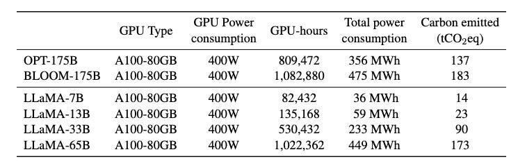

Hello there! This post is a part of the series where we are disecting the details of LLMs. For more information about the series please check out the project [repository](https://github.com/BedirT/LLMWizardry).

# Problem with Inference

Since we are all here, I will assume that we are all very impressed by the level LLMs reached in the past couple years. Even though we are still not at AGI level, we are pretty far along. One issue with all this LLM world I think most of us realized is the speed of output.

The magic of LLM comes with some hefty price in terms of computational power, especially during this output phase where we use the LLM (this is what we call inference). Of course training has significantly larger cost, but once it's done, it's done, as opposed to inference where the cost pretty much goes on.

## The Cost

As we mentioned, LLMs are very computationally expensive. But that's not really the only cost they come with, they are also just expensive... Whether we are using a cloud service to host an LLM, or we are using APIs that cost us pretty pennies for every token they generate, or even when we actually host it locally on our machines (through electricity). I mean if you have a GTR thats drinking the gas like its nobodies business, you would think twice about taking it around the block.

## Environmental Impact

And then there's the elephant in the room: the environmental impact. The energy required to power these computational beasts comes at a cost to our planet. It adds up and contributes to a larger environmental footprint, such that we are actually reporting these numbers in our papers.



[Read more on this here](https://www.linkedin.com/pulse/carbon-impact-large-language-models-ais-growing-cost-vaidheeswaran-fcbhc/)

## The Quest for Efficiency

So, what's a wizard to do? The answer lies in finding more efficient ways to perform inference. This quest for efficiency is not just about saving time or money; it's also about making LLMs more accessible and sustainable in the long run, and in consumer grade computers. It's about ensuring that the magic of LLMs can be experienced by as many people as possible, without breaking the bank or the planet. This is why we are seeing bunch of new models that are getting smaller and smaller like [Mistral-7b](https://mistral.ai/news/announcing-mistral-7b/) and the new [1.58 Bits LLMs](https://arxiv.org/abs/2402.17764).

In the following sections, we'll explore some of the techniques that are helping to make LLM inference more efficient and accessible, such as pruning, knowledge distillation, specialized hardware, and of course, the star of our show (at least for us): quantization.

# Common efficiency techniques in LLM inference

Then let's dive a little into some of the inference optimization techniques out there. We need (at least some of it if not all) these techniques in our magician toolbelt (those little bags that holds the world in them like in fantastic beasts) to bring a more efficient and fast access to LLMs.

## The Art of Pruning


- https://www.tensorflow.org/model_optimization/guide/pruning#:~:text=Magnitude%2Dbased%20weight%20pruning%20gradually,brings%20improvements%20via%20model%20compression.
- https://www.linkedin.com/pulse/traditional-pruning-methods-impact-model-size-speed-ayoub-kirouane/


In the world of gardening, pruning involves cutting back overgrown branches to promote healthy growth. Similarly, in the world of LLMs, pruning is about chopping down the network weights (essentially removing them) to reduce the network size. This process is about identifying and removing the parts of the model that contribute **the least** to its predictions.

Here we only mention two common methods but there are many more that you can read about (some sources listed above).

### Magnitude-based Pruning

Magnitude-based pruning (MP) is one of the simplest methods of pruning. With this technique we trim the less significant weights from a neural network to enhance efficiency.

Here we have a threshold parameter to play with. This is the parameter that we decide the weights below is going to be pruned. Below is the basic process outlined:

1. **Training:** Initially, we train the model in a standard way to learn the patterns and relationships in the data. We need this step to establish a baseline performance.
2. **Ranking:** After training, we evaluate each weight in the model based on its absolute magnitude and rank them. **The idea is that weights closer to zero have a minimal impact on the model's output.**
3. **Pruning:** We then prune the weights (set to zero) based on their ranking, starting with the lowest (those closest to zero). The proportion of weights we prune can vary, but the goal is to strike a balance between model size, speed, and accuracy.
4. **Fine-tuning:** Once we are done with pruning the weights, the model undergoes a fine-tuning process. This step helps the model adjust to the changes and recover any performance lost during pruning.

Couple advantages would be;
- We have a more **efficient model** because less weights mean less computational power and memory.
- Less number of weights meaning less weights to train, so the **speed** is incread.
- Ergo less money...

One thing to consider here is that we have to balance the pruning, how close to 0 is enough to prune. Unfortunately this number can vary between model usecase so it's very hard to find something that fits all.

Now let's end this section with some simple raw python implementation. In this example we imagine that we have a small section of a neural network with ten weights. We define threshold as the percentage of the weights that we will prune.

```python
# Define the initial weights of a neural network layer
weights = [0.2, -0.5, 0.1, 0.4, -0.2, 0.3, 0.05, -0.05, 0.25, -0.15]

# Function to prune weights by magnitude without altering order
def prune_weights_preserve_order(weights, prune_ratio):
    # Determine the number of weights to prune
    num_to_prune = int(len(weights) * prune_ratio)

    # Calculate the absolute value of weights to identify the smallest magnitudes
    abs_weights = [abs(w) for w in weights]

    # Determine the pruning threshold
    # Find the n-th smallest magnitude, where n is the number of weights to prune
    threshold = sorted(abs_weights)[num_to_prune - 1]

    # Prune weights by setting those below the threshold to zero
    pruned_weights = [w if abs(w) > threshold else 0 for w in weights]

    return pruned_weights

# Prune the bottom 30% of weights by magnitude
prune_ratio = 0.3
pruned_weights = prune_weights_preserve_order(weights, prune_ratio)

print("Original weights:", weights)
print("Pruned weights:", pruned_weights)
```


It would be much easier when implemented with numpy or pytorch but I like the very simple nature of raw python implementation and reading.


### Structured Pruning

As opposed to MP, structured pruning focuses on pruning the entirety of neurons, channels or layers instead of the individual weights like we did before. So instead of looking for a redundant weight we are actually looking for redundant big components. While magnitude-based pruning takes a microscopic approach by focusing on individual weights, structured pruning steps back to consider the entire landscape.

I won't go too much into detail in methods of selecting neurons to remove etc. but feel free to read more on it!

## Knowledge Distillation

Imagine if we could capture the essence of a seasoned professor's knowledge and distill it into a format that's both accessible and easy for students to absorb. This is the core idea behind Knowledge Distillation in the context of Large Language Models (LLMs). It's a process where the complex, nuanced understanding contained within a large model (the teacher) is transferred into a smaller, nimbler model (the student). This doesn't just preserve the knowledge but also makes it more efficient to deploy.

Knowledge distillation works by training the student model to replicate the output of the teacher model. The teacher model's predictions serve as a guide, showing the student model not just what to think, but how to think about a wide array of inputs. This process leverages the teacher's deep understanding, allowing the student model to achieve high performance levels with a fraction of the original model's size and computational complexity. Let's see some of the benefits:

- **Efficiency:** The distilled models are significantly more efficient, requiring less computational power for inference. This makes them ideal for deployment in resource-constrained environments, such as mobile devices or edge computing platforms.
- **Speed:** With fewer parameters to crunch, distilled models can offer faster response times, making them suitable for applications requiring real-time processing.
- **Accessibility:** And again money..


One of the most celebrated examples of knowledge distillation in action is the transformation of BERT (Bidirectional Encoder Representations from Transformers), a powerful but resource-intensive model, into DistilBERT. DistilBERT encapsulates the essential knowledge of BERT with a model size that's 40% smaller and 60% faster, yet retains 97% of its language understanding capabilities and performance on benchmark tasks. This transformation is emblematic of knowledge distillation's potential to democratize access to powerful AI tools without compromising on performance.


The problem with knowledge distillation is that we actully need significant resources even though we are training a smaller model. So you still need to train the model, and use a significant effort to do so (around 1/10th of what you needed for the main model).

Another note I want to put here is that, a valid question could be that "why are we not using the data directly in the student model", and the answer is that the teacher model has more nuanced information to give. We do not just use class data but instead we make use of class data probabilities, exposing higher level of knowledge to student.

## Specialized Hardware

One last think I want to mention is the use of specialized hardwares. NVIDIA is great. But the GPUs are not really designed for specific tasks in mind. Building specialized architectures would make LLMs much much faster. And this is not a guess, if you haven't heard of [Groq](https://groq.com/), I highly suggest you go ahead and run a couple of prompts to see the speed. This is by far the fastest LLM inference I saw, thanks to their in-house device architectures.

## Quantization

This is the main beacon we will disect, so we are discussing this on its own section below!

# Sharding


- https://huggingface.co/docs/transformers/big_models
-


# Quantization

## What is Quantization?

## Zero-Point Quantization

## Weight Quantization vs Activation Quantization

## Post-training Quantization vs Pre-training Quantization

## Quantization-aware Training and Fine-tuning

## Checking GPU Specifications for Determining Quantization Method

## Implementing a simple Quantization Method

## How to Quantize an LLM using Huggingface

## Pre-quantization

# Common Quantization Techniques

## GPTQ
- Post-training quantization
- Focuses primarily on GPU inference and performence
- 4-bit quantization
- Method: Tries to compress all the weights to a 4-bit format by minimizing the MSE between the original and quantized weights. During inference, it will dynamically dequantize the weights to float16 for improved performance while keeping low memory usage.

```python
from transformers import AutoModelForCausalLM, AutoTokenizer, pipeline

model_id = "TheBloke/zephyr-7B-beta-GPTQ"
tokenizer = AutoTokenizer.from_pretrained(model_id, use_fast=True)
model = AutoModelForCausalLM.from_pretrained(
    model_id,
    device_map="auto",
    trust_remote_code=True,
    revision="main",
)

pipe = pipeline(task="text-generation", model=model, tokenizer=tokenizer)

outputs = pipe(
    "The quick brown fox jumps over the lazy dog",
    do_sample=True,
    max_new_tokens=50,
    temperature=0.1,
    top_p=0.95
)
print(outputs[0]["generated_text"])
```

## GGUF (previously GGML)
- Focuses on CPU inference
- Allows to use CPU to run an LLM but also offloads some of the layers to GPU for improved performance
- Convenient for personal use
- Method: ?

```python
from ctransformers import AutoModelForCausalLM
from transformers import AutoTokenizer, pipeline

model = AutoModelForCausalLM.from_pretrained(
    "TheBloke/zephyr-7B-beta-GGUF",
    model_file="zepryr-7b-beta.Q4_K_M.gguf",
    model_type="mistral",
    gpu_layers=50,
    hf=True
)
tokenizer = AutoTokenizer.from_pretrained("HuggingFaceH4/zephyr-7B-beta", use_fast=True)

pipe = pipeline(task="text-generation", model=model, tokenizer=tokenizer)

outputs = pipe(
    "The quick brown fox jumps over the lazy dog",
    do_sample=True,
    max_new_tokens=50,
    temperature=0.1,
    top_p=0.95
)
print(outputs[0]["generated_text"])
```

## AWQ
- Activation-aware Weight Quantization
- Similar to GPTQ but has some differences
- An important difference is that AWQ assumes that not all weights are equally important. There is some small fraction of weights that will not be quantized to help the quantization loss. This speeds up the inference and sometimes even yields better results than GPTQ.
- Use vllm here. Much faster inference

```python
from vllm import LLM, SamplingParams

sampling_params = SamplingParams(
    temperature=0.7,
    top_p=0.95,
    max_tokens=50,
)
llm = LLM(
    model="TheBloke/zephyr-7B-beta-AWQ",
    quantization="awq",
    dtype="half",
    gpu_memory_utilization=0.95,
    max_model_len=4096
)

output = llm.generate(
    "The quick brown fox jumps over the lazy dog",
    sampling_params=sampling_params
)
print(output[0].outputs[0].text)
```

# References
- https://www.youtube.com/watch?v=mNE_d-C82lI&t=7s
- https://www.youtube.com/watch?v=UcwDgsMgTu4
- https://www.linkedin.com/pulse/carbon-impact-large-language-models-ais-growing-cost-vaidheeswaran-fcbhc/
https://arxiv.org/abs/2402.17764
https://mistral.ai/news/announcing-mistral-7b/