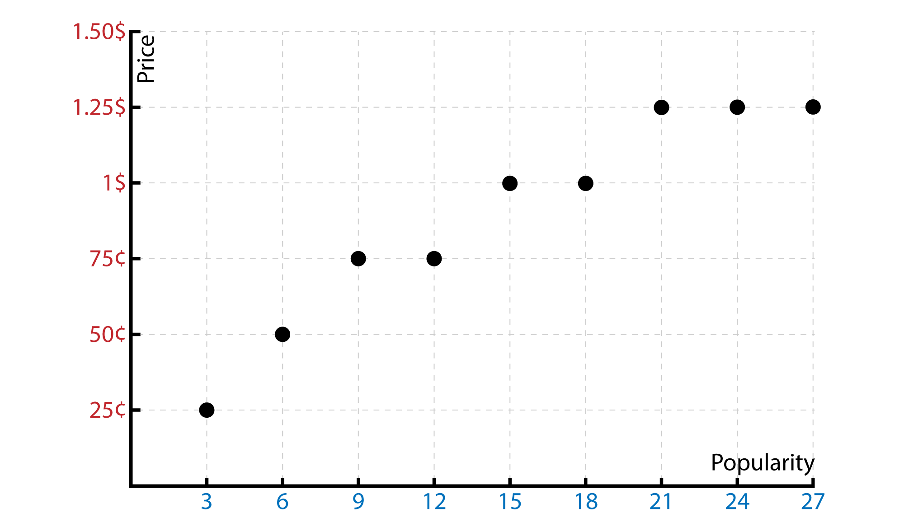
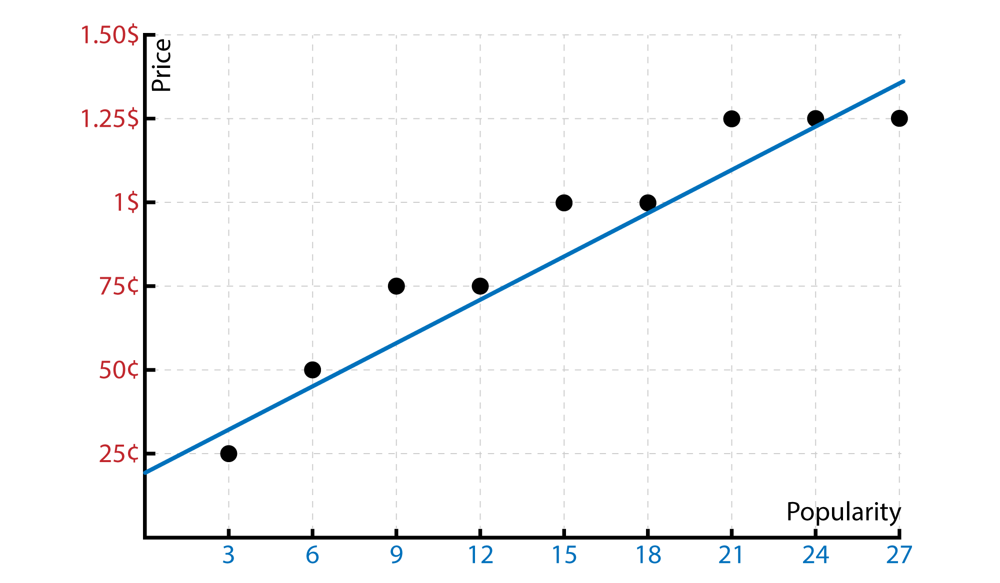
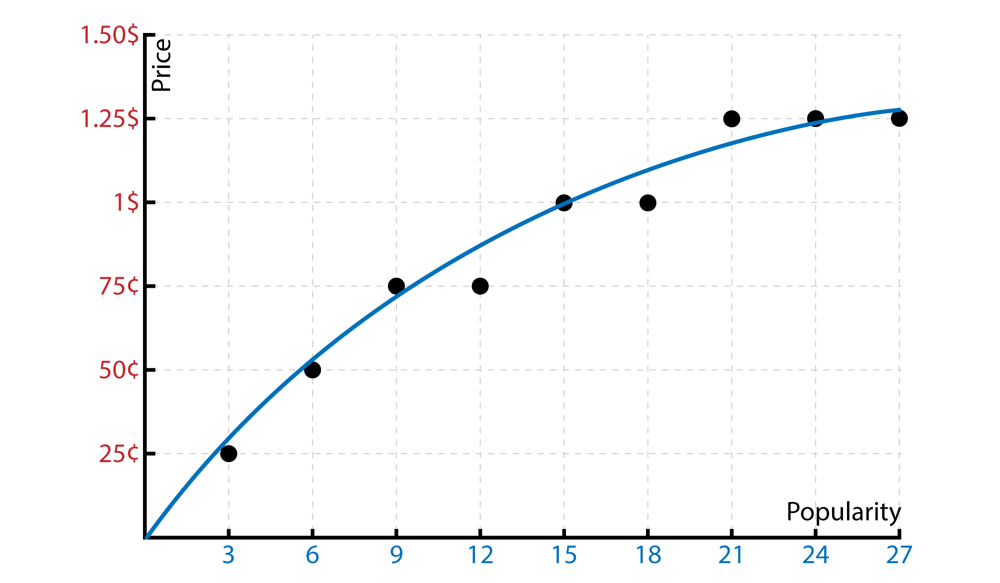
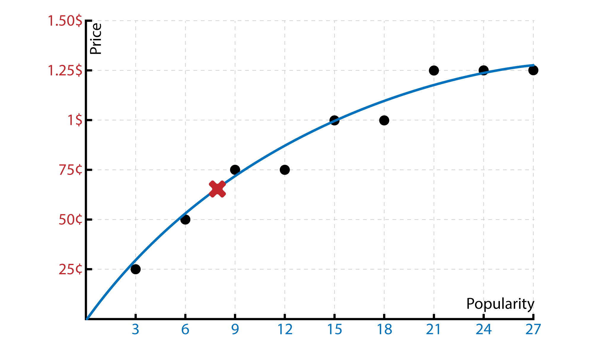
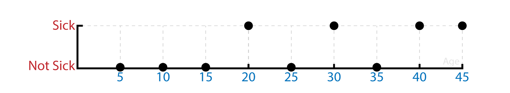
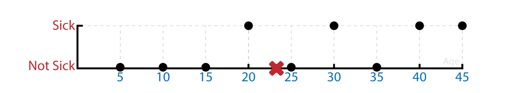
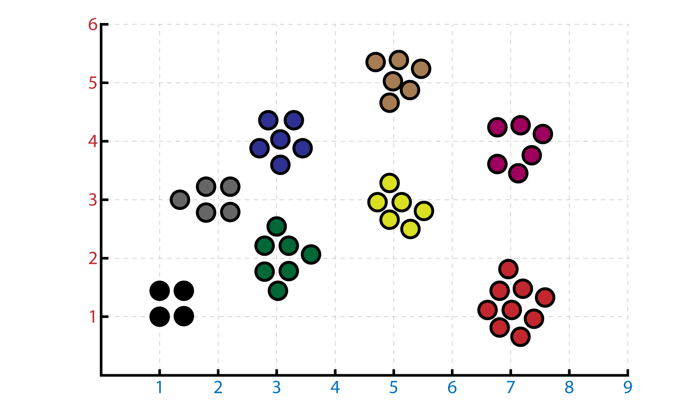

Reaaally introductory post for Machine Learning basics. What is Supervised and Unsupervised learning?

<!--more-->

## Supervised Learning

**Supervised learning** is the most common machine learning problem. In Supervised Learning we already know what the correct output should be like. 

There are two categories for supervised learning, first one is **"regression problem"** and the second one is **"classification problem"**. I will explain both with examples.

## Regression Problems

In regression we have an output that is continous and we are trying to predict what will be the correct answer/output/label for our input. Lets see an example to understand the concept better.

### Examples:

Let's say we have a friend who has a chocalate company. He has a lot of money and he wants to make his product sell as many as Snickers. OK. But his chocalates are not famous as Snickers. Now , what he should do is, take a look at the competitor. There is a chart which has two dimensions. One is the price. Another is the popularity. Now that since we have continous output for the prices. We will predict the one that we are looking for. (I will just give the popularities according to myself.)

Now, looking at this output. What should we do is, putting a straight or polinomial line to the outputs.

Then we will have our line that will help us to predict the price. According to the surveys, our chocalates have 8 point for the popularity. So what will be the best price according to the survey and the industry... 

It seems something like 70¢ ...

This is the regression problem ...

## Classification Problems

In classification, the simplest one, binary classification, we have two options, either true or false. We also can say that we will predict the result in a binary map. Let's check an example.

### Examples:

Let's give an absurd example so that it will be more permament. So we have a friend who just ate 5 kilos of Nutella and he is 24 years old. We want to predict if he will get sick or not. And we have a dataset that have people's ages that ate 5 kilos of Nutella and got the sick or not !!

So according to this graph our friend will get sick or not. It is a binary example. There is just two probabalities. This is a classification problem. Let's see the expected result ...

(He will probably get sick, according to our prediction.) 

## Unsupervised Learning

The **unsupervised learning** is the second most common machine learning problem. In unsupervised learning we don't know the result for each input. We will obtain a structure form the data. We do not know what are the exact effects of our inputs. We will use **clustering** for this.

## Clustering Problem

We basically will seperate the data according to variables.

Let's say you got hundred different composition classes' final essays. They all have different topics. What clustering do is, classifying all the essays according to their topics. So that if we use clustering, all these classes' articles will be separated. This is just one variable (topic). If you want, you can add more variables to make the groups more specific. In this case we can add words count for example.

 
