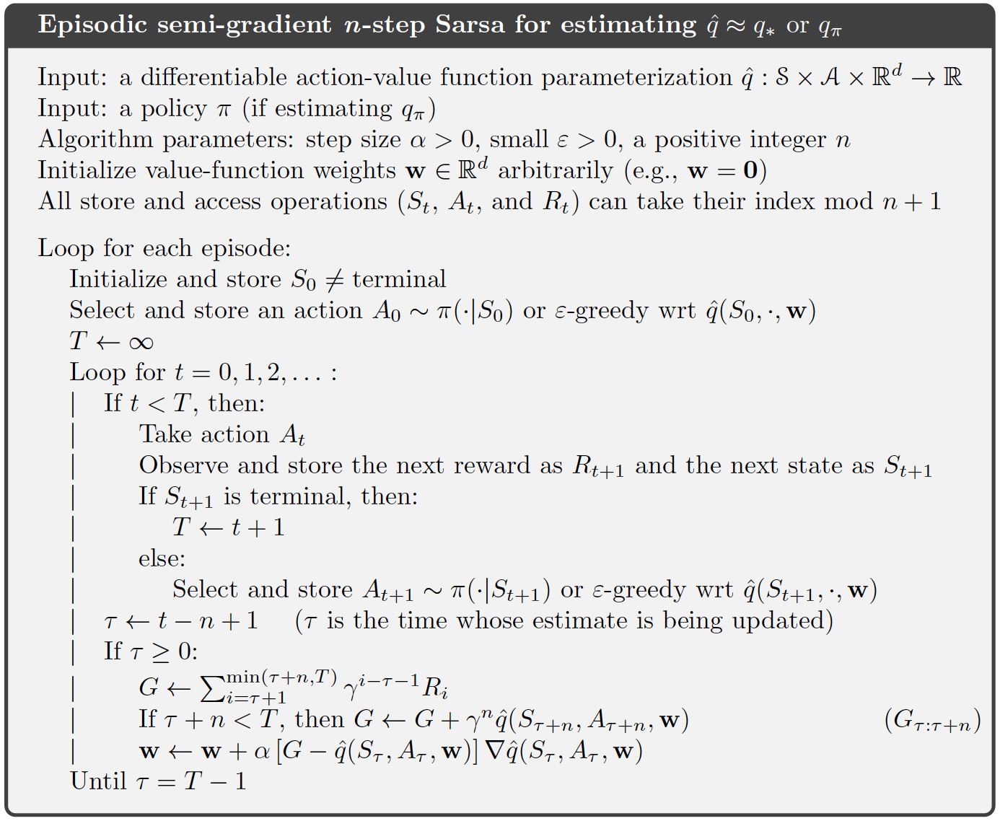
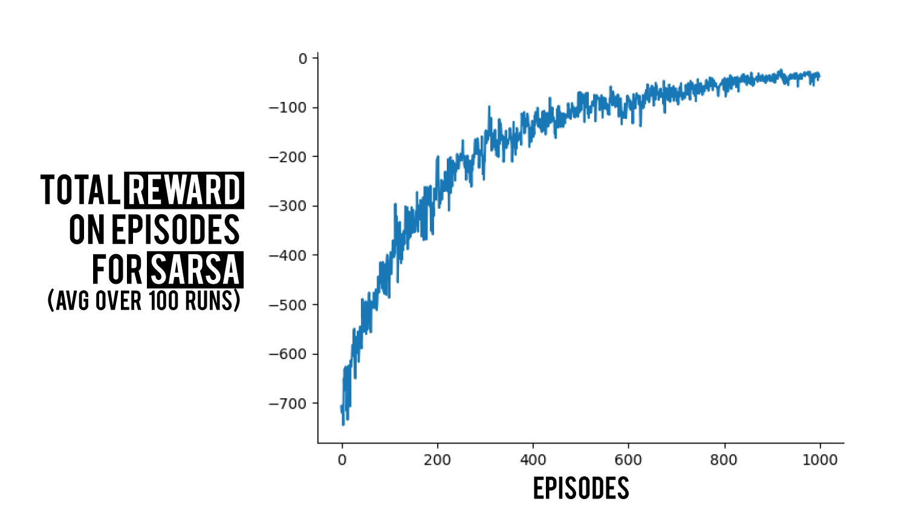

### Prerequisites 

- Semi-Gradient Prediction
- Intro to Linear Methods

If you read the prediction part for the semi gradient methods, it is pretty easy to extend what we know to the control case. We know that control is almost all the time just adding policy improvement over the prediction case. That's exactly the case for us here for semi-gradient control methods as well.

We already have describe and understood a formula back in prediction part (if you read it somewhere else that's also fine), and now we want to extend our window a little. 

For prediction we were using $S_t \mapsto U_t$ examples, now since we have action-values instead of state-values (because we will pick the best action possible), we will use examples of form $S_t, A_t \mapsto U_t$ meaning that instead of $v_\pi(S_t)$ we will be using estimations for $q_\pi(S_t, A_t)$. 

So our general update rule would be (following from the formula for prediction);

$$
w_{t+1} = w_t + \alpha [U_t - \hat{q}(S_t, A_t, w_t)] \nabla\hat{q}(S_t, A_t, w_t)
$$

As we always do, you can replace $U_t$ with any approximation method you want, so it could have been a Monte Carlo method (Though I believe this does not count as semi-gradient, because it will be a direct stochastic gradient since it does not use any bootstrapping, but the book says otherwise so I am just passing the information 😄). Therefor we can implement an $n$-step episodic SARSA with an infinite option, which will correspond to Monte-Carlo (We will learn a better method to do this in future posts). 

The last piece of information to add is the policy improvement part, since we are doing control, we need to update our policy and make it better as we go of course. Which won't be hard cause we will just be using a soft approximation method, I will use the classic $\epsilon$-greedy policy. 

One more thing to note, which I think is pretty important, for continuous action spaces, or large discrete action spaces methods for the control part is still not clear. Meaning we don't know what is the best way to approach yet. That is if you think of a large choices of actions, there is no good way to apply a soft approximation technique for the action selection as you can imagine.

For the implementation, as usual we will just go linear, as it is the best way to grasp every piece of information. But first I will as usual give the pseudo-code given in the book.



I only took the pseudocode from chapter 10.2 because we don't really the one before, as it is only the one step version. We are interested in the general version therefor n-step.

### Implementation

```python
def __init__(self, feature_space, action_space, alpha = 0.0001, gamma = 0.99, eps = .1):
    self.alpha = alpha
    self.gamma = gamma
    self.eps = eps

    self.feature_space = feature_space
    self.action_space = action_space

    self.reset_weights()
        
def reset_weights(self):
    self.w = np.random.rand(self.feature_space * self.action_space)        
```

**Initialize** We start by initializing the necessary things; we need step size $\alpha$ also $\gamma$ and $\epsilon$. Other then these we need to initialize our weight vector. We will have a weight vector that is for each action concatenated after one another. So if we assume that we have 4 observations lets say [1 0 1 0], meaning weights 0 and 2 are active, and if want to update the weights for action 0, we will have [**1 0 1 0** 0 0 0 0 0 0 0 0] if we had 3 possible actions in total. After when we are using $\epsilon$-greedy this will make more sense.

```python
def step(self, obs):
    if np.random.sample() > self.eps:
      return np.argmax(self._act(obs))
    else:
      return np.random.randint(0, self.action_space)
```

**Let's move** next thing is to take a step, meaning we will pick the action according to our action-values at hand. We take the observations as input, this will come from the environment, and assuming we get an array of the probabilities for each action given the observations from ` _act(obs)`. Then all we have to do is to roll the die and decide if we will choose a random action or we will choose the action that has the most value for the current time, and thats exactly what we do here ($\epsilon$-greedy action selection). 

```python
def _act(self, obs):
    q_vals = np.zeros(self.action_space)
    for a in range(self.action_space):
        q_vals[a] = self.q_hat(obs, a)
    return q_vals
```
**Best $\hat{q}$-value** now we need to fill the function `_act(obs)`. Which basically will call $\hat{q}(s, a, w)$ for each action and store them in an array and return it. 

```python
def q_hat(self, obs, action):
    return self.w.T.dot(self._x(obs, action))
```

Continuing from there we have the $\hat{q}(s,a,w)$ to implement. Which is just writing down the linear formula since we are implementing it linearly. Therefor $\hat{q}(s,a,w) = w^Tx(s, a)$ where $x(s,a)$ is the state action representation. In our case as I already mention this will just be the one hot vector, all the observations are added after one another for each action.

```python
def _x(self, obs, action):
    one_hot = np.zeros_like(self.w)
    one_hot[action * self.feature_space:(action+1) * self.feature_space] = obs
    return one_hot
```

**Finally** $x(s, a)$ - as I already mentioned twice 😄 we create the $x$ in a vector that everything 0 other than the active action.

That was the last thing for us to be able to choose the action for a given state. So let's have a broader respective and assume that we are using the `step(obs)` here is how it would be like:

```python
action = agent.step(obs)
obs, reward, done = env.step(action)
```

Now we see what is left ? Update... :man_facepalming: Yeah without update there is no change basically. Which will also be the one differs for the $n$. Let's remember the formula;

$$
w_{t+1} = w_t + \alpha[R_{t+1} + \gamma R_{t+2} + \ldots + \gamma^n\hat{q}(S_{t+n},A_{t+n},w_{t}) - \hat{q}(S_{t},A_{t},w_{t})] \nabla\hat{q}(S_t, A_t, w_t)
$$

```python
def update(self, observations, actions, rewards):
        if len(observations) > self.n+1:
            observations.pop(0)
            rewards.pop(0)
            actions.pop(0)

        if len(rewards) == self.n+1:
            G = sum([(self.gamma ** t) * r for t,r in enumerate(rewards[:-1])])
            G += (self.gamma ** (self.n)) * self._q_hat(observations[-1], actions[-1])
            self.w += self.alpha * (G - self._q_hat(observations[0], actions[0])) * \
            self._grad_q_hat(observations[0], actions[0])
```

There is a bit of a change here, from the pseudocode I provided. Since we want a full seperation between the agent-environment-experiment we need a class system for the algorithms therefor we won't be following what is on the pseudocode. 

**Update** what happens here is actually not that different, since we only need $n+1$ elements to make the update happen we won't keep the rest of the trajectory. Whenever we use n numbered trajectory the first element becomes useless for the next update. Therefor we remove the first element from the trajectory and use the rest to make our update.

**Terminal** we also have a terminal state, and as can be seen in the pseudocode there are some differences that should be changed for the updates when we reach the terminal state. Logical enough, we do not have n+1 element left to complete the calculation we were doing therefor we will just use the rewards rather than $\hat{q}(s,a,w)$ . Therefor we need another function to handle this, which we call `end()` in our structure;

```python
def end(self, observations, actions, rewards):
        for _ in range(self.n):
            observations.pop(0)
            rewards.pop(0)
            actions.pop(0)

            G = sum([(self.gamma ** t) * r for t,r in enumerate(rewards)])
            self.w += self.alpha * (G - self._q_hat(observations[0], actions[0])) * \
            self._grad_q_hat(observations[0], actions[0])
```

Here as we can see we are not doing something too different. It is just that we are using the last elements we have left and we will remove all the elements from the trajectory while making the last updates to our weights.

Yeah and we are almost done, exept that I didn't show the `grad_q_hat()` yet, which basically gives the $\nabla\hat{q}(s,a,w)$.

```python
def grad_q_hat(self, obs, action):
    return self._x(obs, action)
```

Surprise.. Yeah since we are using linear functions, $\nabla w^Tx(s, a) = x(s,a)$. That's all.

Let's see how would be the experiment part and run the code to get some results then.

```python
params = {
    'num_of_episodes' : 1000,
    'max_steps' : 1000,
    'alpha' : 2 ** (-14),
    'gamma' : 0.98,
    # Creating the tilings
    'grid_size' : 5,
    'tile_size' : 4,
    'num_of_tiles' : 5
}
# environment
env = grid_world(portal=True)
action_space = env.action_space.shape[0]

# tile coding
tilings = tile_coding(env.grid_size[0], params['num_of_tiles'], params['tile_size'], action_space)
state_space = tilings.num_of_tilings

# Keep stats for final print and data
episode_rewards = np.zeros(params['num_of_episodes'])

# Agent created
n = 8
agent = SG_SARSA(state_space, action_space, n, params['alpha'], params['gamma'])

np.random.seed(1)

for ep in range(params['num_of_episodes']):

    rewards = []
    observations = []
    actions = []

    obs = tilings.active_tiles(env.reset()) # a x d

    score = 0

    for t in range(params['max_steps']):
        action = agent.step(obs)
        observations.append(obs)

        obs, reward, done = env.step(action)
        obs = tilings.active_tiles(obs)

        rewards.append(reward)
        actions.append(action)

        score += reward

        if done:
            agent.end(observations, actions, rewards)
            break
        else:
            agent.update(observations, actions, rewards)

		episode_rewards[ep] = score
    print("EP: {} -------- Return: {}      ".format(ep, score), end="\r", flush=True)

```

I used tile coding and the grid world environment in our library. If you want you can modify a little to use another state representation or Rich Sutton's tile coding library, or for environment gym.

Anyways, what we do is pretty simple if you read through, and you can ask for clarification on any point if looks weird.

Main point here are the agent functions and how we use them, all three are used as we said, on each step we have the `agent.step()`, for each step we have the `update()` called except the terminal state. Which we will call `end()` instead.

I will give only one graph as result as usual, here is 100 runs on the stochastic grid world environment.



If you liked this post follow [BetterRL](https://github.com/BedirT/BetterRL), and keep a like down below. I have a blog series on RL algorithms that you can [check out](bedirt.github.io). Also you can check the repo where I share raw python RL code for both environments and algorithms. Any comments are appreciated!

[For full code](https://github.com/BedirT/BetterRL/blob/master/value_based/Semi_Gradient_SARSA.py)